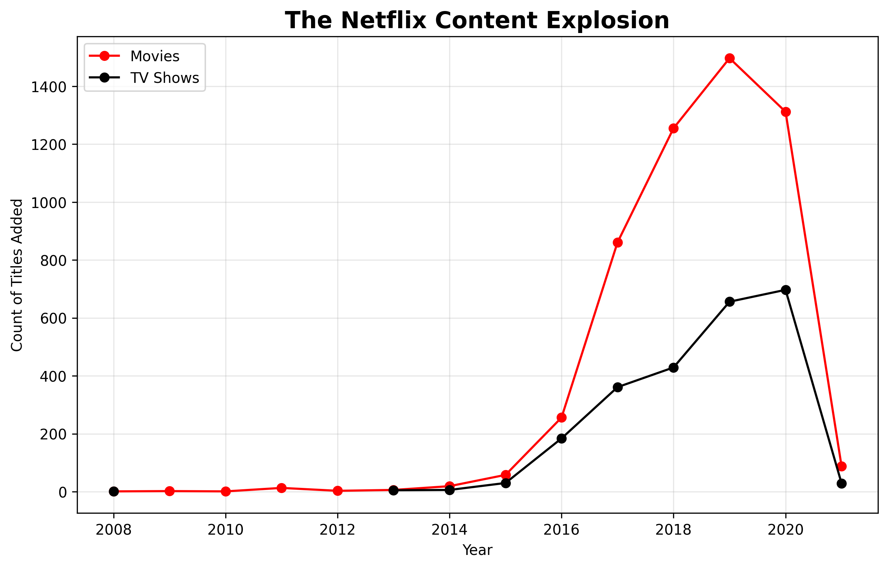

# Netflix Content Strategy Analysis

### Project Overview
A data-driven analysis exploring how Netflix’s content library has shifted from Movies to TV Shows over the last decade.

### Key Technical Steps
* **Data Audit:** Identified 2,000+ missing values in the director column.
* **Data Cleaning:** Replaced nulls with "Unknown" and performed surgical row deletion for critical missing dates.
* **Feature Engineering:** Extracted `year_added` from string dates using Python `datetime`.
* **Data Reshaping:** Used `groupby` and `unstack` to prepare multi-category data for visualization.

### Tools Used
* **Python** (Pandas, Matplotlib)
* **Jupyter Notebook**

### Key Insights
1. **The 2019 Peak:** Netflix hit its highest volume of new content in 2019.
2. **TV Show Growth:** TV Shows are growing at a faster rate than Movies, showing a shift toward episodic content.
3. **Data Integrity:** By cleaning the "ghost spaces" in dates, I ensured 100% accuracy in the trend timeline.

### Final Visualization
